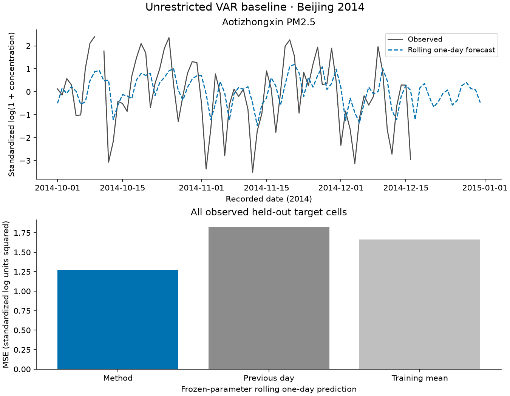

# Unrestricted VAR baseline: an air-quality walkthrough

[Gallery and data protocol](../real-world-examples.md) · [All examples](index.md) · [API](https://dx-li.github.io/MaVaTS/mavats.html#fit_var)

## Question and applicability

Can yesterday's station-by-pollutant pattern predict tomorrow's transformed observations?

Dense vectorization discards separable structure; this small panel keeps the parameter count manageable.

Paper attribution: [chen2021mar](../citations.md#chen2021mar), [hoerl1970ridge](../citations.md#hoerl1970ridge). This is a new teaching application,
not reproduction of a paper's empirical results or endorsement by its authors.

## Data and execution

Observed Beijing data: (365, 4, 3) = day × station × pollutant.
Train: January–September 2014 (273 days). Held out: October–December (92 days).
The [shared protocol](../real-world-examples.md#data-and-preprocessing) specifies
provenance, missingness, training-only transformations and observational limits.

From a checkout with the examples extra installed:

```bash
python -m examples.air_quality --methods var --output /tmp/mavats-gallery
```

The snippet includes shared preprocessing and the core call. Special setups
use `fit_case`, whose source explicitly defines constraints, lag alignment or
stream state. The executable [runner](../../examples/air_quality/__main__.py)
also contains the complete evaluation and plotting recipe.

```python
from examples.air_quality.data import load, preprocess
from examples.air_quality.cases import CASES
case = next(c for c in CASES if c.id == "var")
dates, values, counts = load()
x, observed, preprocessing = preprocess(values, counts, train=273, tensor=False)
from mavats import fit_var
result = fit_var(x[:273])
```

## Computed result

Run status: **completed**. This records numerical execution, not
scientific validity. Unconverged output is diagnostic only; rejected fits
have no substituted estimate. [Full diagnostics](var.json) include
warnings, convergence, preprocessing counts and method-specific quantities.

Training cells imputed: 142; held-out cells imputed: 62. Gaps in the observed trace mark insufficient readings; predictions over those gaps are not scored.

Computed forecast_mse: **1.2698** over 1042 observed target cells. Previous-day MSE: 1.8212; fixed-training-mean MSE: 1.6649. Lower is better on this split only; no uncertainty interval is estimated.



The first-cell display is predeclared (Aotizhongxin PM2.5, morning for tensors),
not selected for visual appeal. Forecast/reconstruction metrics use all observed
held-out cells, excluding imputed targets. Reconstruction sees the target day;
it must not be read as a forecast or measured recovery of an unknown clean signal.
Diagnostic-only plots can instead use training data as explicitly labelled.

[Numerical plot/score arrays](var.npz) and [run provenance](provenance.json)
allow checking displayed results. No causal, health or regulatory conclusion follows.
